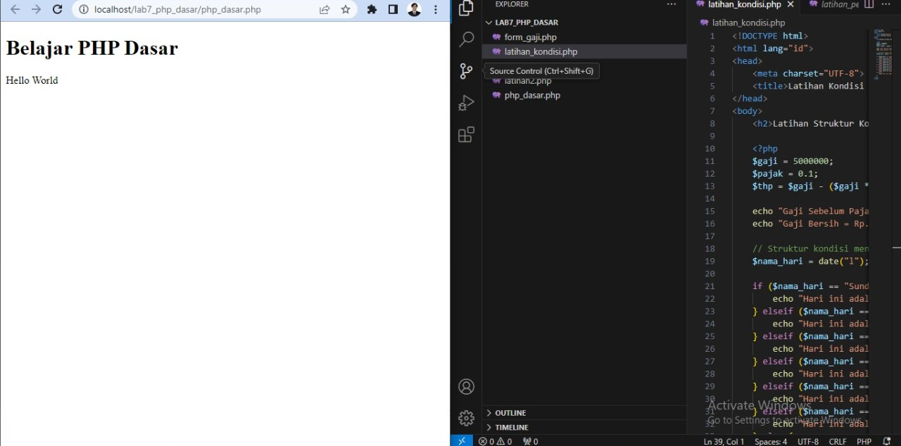
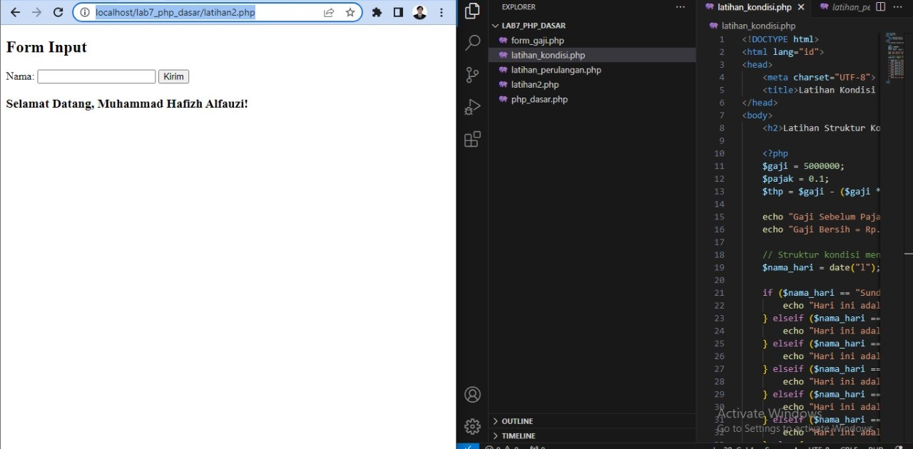
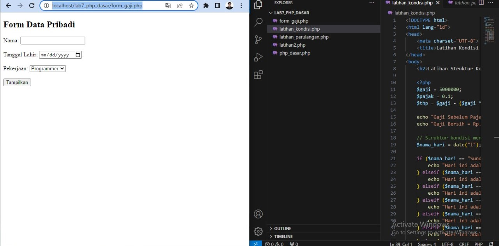
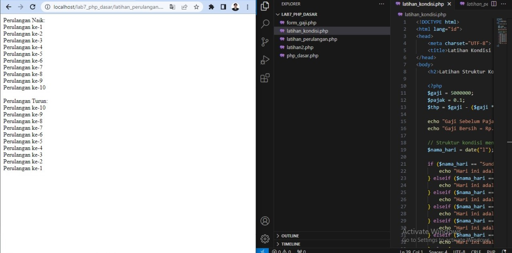
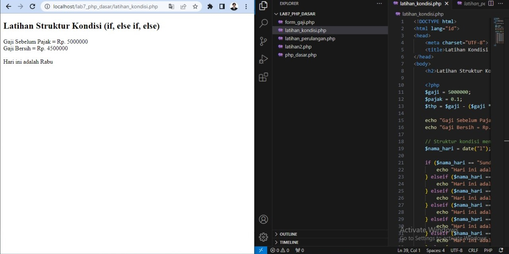

## 🧾 **README.md – Praktikum 7: PHP Dasar**

```markdown
# Praktikum 7: PHP Dasar

**Nama:** Muhammad Hafizh Alfauzi  
**NIM:** 312410501  
**Kelas:** TI.24.A5  
**Mata Kuliah:** Pemrograman Web  
**Dosen Pengampu:** Agung Nugroho, S.Kom., M.Kom  

---

## 🧠 Tujuan Pembelajaran
1. Mempelajari dasar bahasa pemrograman **PHP**.  
2. Memahami cara kerja **server-side scripting** menggunakan **XAMPP (Apache)**.  
3. Mengenal **variabel, tipe data, operator, kondisi, dan perulangan** pada PHP.  
4. Membuat **program interaktif sederhana** dengan input dan output menggunakan form.  

---

## ⚙️ Persiapan Lingkungan
1. Install dan jalankan **XAMPP**.  
2. Aktifkan **Apache** dari XAMPP Control Panel.  
3. Buat folder di:
```

C:\xampp\htdocs\lab7_php_dasar

````
4. Buka folder tersebut di **Visual Studio Code (VS Code)** untuk menulis kode PHP.

---

## 🧩 Langkah-Langkah Praktikum

### 1️⃣ Membuat File `php_dasar.php`
Menampilkan teks dan variabel PHP dasar.

```php
<!DOCTYPE html>
<html>
<head>
 <title>PHP Dasar</title>
</head>
<body>
 <h1>Belajar PHP Dasar</h1>
 <?php
     echo "Hello World";
     $nim = "312410501";
     $nama = "Muhammad Hafizh Alfauzi";
     echo "<br>NIM : " . $nim;
     echo "<br>Nama : " . $nama;
 ?>
</body>
</html>
````

🖼️ *Screenshot hasil:*
 >  

---

### 2️⃣ Membuat Form Input (`latihan2.php`)

Contoh penggunaan **form** dan **$_POST**.

```php
<!DOCTYPE html>
<html>
<head>
    <title>Form Input</title>
</head>
<body>
    <h2>Form Input</h2>
    <form method="post">
        <label>Nama:</label>
        <input type="text" name="nama" required>
        <input type="submit" value="Kirim">
    </form>

    <?php
    if ($_SERVER["REQUEST_METHOD"] == "POST") {
        echo "<h3>Selamat Datang, " . $_POST['nama'] . "!</h3>";
    }
    ?>
</body>
</html>
```

🖼️ >  


---

### 3️⃣ Struktur Kondisi (`latihan_kondisi.php`)

```php
<?php
$gaji = 5000000;
$pajak = 0.1;
$thp = $gaji - ($gaji * $pajak);

echo "Gaji Sebelum Pajak = Rp. $gaji <br>";
echo "Gaji Bersih = Rp. $thp <br><br>";

$nama_hari = date("l");
if ($nama_hari == "Sunday") {
    echo "Hari ini: Minggu";
} elseif ($nama_hari == "Monday") {
    echo "Hari ini: Senin";
} else {
    echo "Hari ini: $nama_hari";
}
?>
```

🖼️ >  

---

### 4️⃣ Struktur Perulangan (`latihan_perulangan.php`)

```php
<?php
echo "Perulangan Naik:<br>";
for ($i = 1; $i <= 10; $i++) {
    echo "Perulangan ke-$i<br>";
}

echo "<br>Perulangan Turun:<br>";
for ($i = 10; $i >= 1; $i--) {
    echo "Perulangan ke-$i<br>";
}
?>
```

🖼️ >  

---

### 5️⃣ Program Gaji & Umur (`form_gaji.php`)

Tugas akhir menggunakan **form input + perhitungan umur & gaji**.

```php
<!DOCTYPE html>
<html lang="id">
<head>
    <meta charset="UTF-8">
    <title>Program Gaji & Umur</title>
</head>
<body>
    <h2>Form Data Pribadi</h2>
    <form method="post">
        <label>Nama:</label>
        <input type="text" name="nama" required><br><br>

        <label>Tanggal Lahir:</label>
        <input type="date" name="tanggal_lahir" required><br><br>

        <label>Pekerjaan:</label>
        <select name="pekerjaan" required>
            <option value="Programmer">Programmer</option>
            <option value="Desainer">Desainer</option>
            <option value="Fotografer">Fotografer</option>
            <option value="Guru">Guru</option>
        </select><br><br>

        <input type="submit" value="Tampilkan">
    </form>

    <?php
    if ($_SERVER["REQUEST_METHOD"] == "POST") {
        $nama = $_POST["nama"];
        $tanggal_lahir = $_POST["tanggal_lahir"];
        $pekerjaan = $_POST["pekerjaan"];

        $tanggal_sekarang = new DateTime();
        $lahir = new DateTime($tanggal_lahir);
        $umur = $tanggal_sekarang->diff($lahir)->y;

        switch ($pekerjaan) {
            case "Programmer": $gaji = 7000000; break;
            case "Desainer": $gaji = 6000000; break;
            case "Fotografer": $gaji = 5500000; break;
            case "Guru": $gaji = 5000000; break;
        }

        echo "<h3>Hasil:</h3>";
        echo "Nama: $nama <br>";
        echo "Tanggal Lahir: $tanggal_lahir <br>";
        echo "Umur: $umur tahun<br>";
        echo "Pekerjaan: $pekerjaan <br>";
        echo "Gaji: Rp " . number_format($gaji, 0, ',', '.');
    }
    ?>
</body>
</html>
```

🖼️  >  

---

## 📚 Kesimpulan

* PHP adalah **bahasa pemrograman server-side** yang berjalan di sisi server (bukan browser).
* Dengan PHP, kita bisa membuat halaman web **dinamis dan interaktif**.
* Fungsi `$_POST` dan `$_GET` digunakan untuk menangani input dari form.
* Struktur kondisi dan perulangan pada PHP mirip dengan bahasa lain seperti C atau Java.

---

## 🔗 Link Repository

> [https://github.com/username/Lab7Web](https://github.com/username/Lab7Web)

## 🙏 Terimakasih
